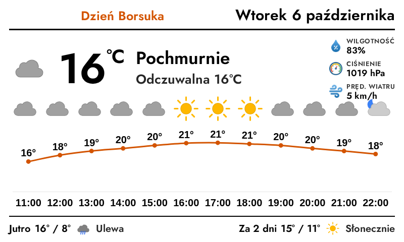

# InkyPi-ha_weather_card

*HA Weather Card* is a plugin for [InkyPi](https://github.com/fatihak/InkyPi) that draws an e-ink weather card from a Home Assistant weather entity.

It reads the weather entity (and optional per-stat sensors) from the Home Assistant REST API and renders its own card, so it needs no browser or dashboard screenshot and runs comfortably on a Raspberry Pi Zero 2 W. It is a port of the [E-Ink-Weather-Card](https://github.com/jeakob/E-Ink-Weather-Card).

## Screenshot



## What it shows

- **Header** — title (left), optional custom text (centre, auto-shrinks to fit and hides
  if there is no room), and the day/date/time (right).
- **Current** — condition icon (day/night variant chosen from the real sun position),
  temperature, condition text, feels-like, and an attribute list (humidity, pressure, wind,
  and optionally dew point, visibility, UV, wind gust).
- **Forecast** — either a **daily summary** of the next days, or an **hourly chart**
  (temperature line + chance-of-rain bars) with a "Tomorrow / In 2 days" footer.

## Installation

Install the plugin using the InkyPi CLI, providing the plugin ID and GitHub repository URL:

```bash
inkypi plugin install ha_weather_card https://github.com/jeakob/InkyPi-ha_weather_card
```

Run the same command again to update. Remove it with `inkypi plugin uninstall ha_weather_card`.

## API Keys

The plugin uses your own Home Assistant's [REST API](https://developers.home-assistant.io/docs/api/rest/), so there is no external service, cost or rate limit.

1. In Home Assistant, open your **Profile → Security** and create a **long-lived access token**.
2. In InkyPi, open **API Keys**, add a key named `HA_ACCESS_TOKEN` and paste the token. It is stored in the `.env` file:
    ```
    HA_ACCESS_TOKEN=your-token
    ```

## Setup

Add the **HA Weather Card** plugin to a playlist and set:

- **Home Assistant URL** — e.g. `https://homeassistant.local:8123`
- **Weather entity** — e.g. `weather.home`
- **Sun entity** — defaults to `sun.sun`; used to pick day vs. night icons from the real sunrise/sunset. Only change it if you renamed the entity.
- Tick **Skip SSL verification** only if your Home Assistant uses a self-signed certificate.

## Features & settings

- **Localization** — English and Polish (including localized day/month names and weather
  conditions). More languages can be added to `locale.json`.
- **Custom text** — a literal string, or pulled live from a sensor/attribute. For a
  **calendar** entity it shows the event `message` only while the event is active, and
  appends the start time for timed events.
- **Title** — a literal string, a sensor/attribute, or a calendar (hidden when the calendar
  is off); otherwise falls back to the entity name.
- **Alternative sensors** — override any stat (temperature, feels-like, humidity, pressure,
  wind, UV, dew point, visibility, etc.) with a different entity. Useful when the weather
  entity lacks an attribute such as `apparent_temperature`.
- **Show/hide toggles** for every section and attribute, plus the clock (day / date / time,
  12- or 24-hour).
- **Forecast** — daily or hourly, configurable number of points. The hourly chart plots the
  **chance of rain** (precipitation probability); the **Rain bar threshold** hides bars
  below a given probability so they appear only when rain is likely.
- **Daily summary** — an optional "Tomorrow / In 2 days" footer. Both labels default to the
  language pack but can be overridden with your own text.
- **Day / night icons** — chosen from Home Assistant's sun entity: its above/below-horizon
  state picks the current icon and its sunrise/sunset times pick each hourly-forecast icon,
  so a sunny evening shows a sun, not a moon. Falls back to a clock if the entity is missing.
- **Appearance** — text and accent colours, a separate **title colour**, and per-element
  font sizes (temperature, condition, attributes, title, forecast icon/text, feels-like,
  description, day/date, time, summary).
- **Bold text** — a global **Bold text** toggle (default on) sets the overall weight, and
  each editable text field has its own bold toggle on top of it: **title**, **custom text**,
  **feels-like**, and the **daily-summary labels**. All default to bold and can be turned off
  independently.

## Notes

- Charts use the bundled `chart.js` (vendored by InkyPi's `update_vendors.sh`).
- The forecast is fetched via the `weather.get_forecasts` service
  (`POST /api/services/weather/get_forecasts?return_response`), as modern Home Assistant no
  longer exposes the forecast as a state attribute.
- Weather providers differ — some omit `apparent_temperature` or `precipitation_probability`.
  Use an alternative sensor where needed.

## Development status

Actively maintained.

## License

This project is licensed under the GNU General Public License v3.0, the same as InkyPi — see the [LICENSE](LICENSE) file.

The card design and weather icons are ported from [E-Ink-Weather-Card](https://github.com/jeakob/E-Ink-Weather-Card) / [weather-chart-card](https://github.com/mlamberts78/weather-chart-card), MIT License, Copyright (c) 2023 Marc Lamberts.
